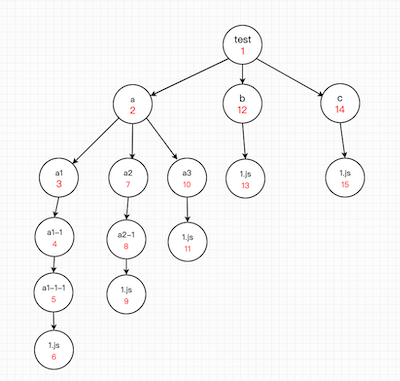
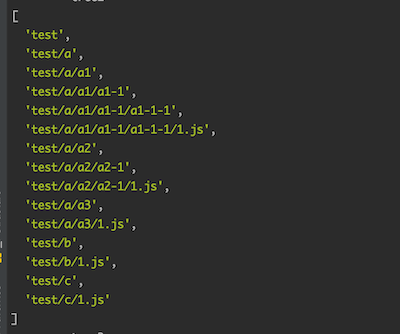
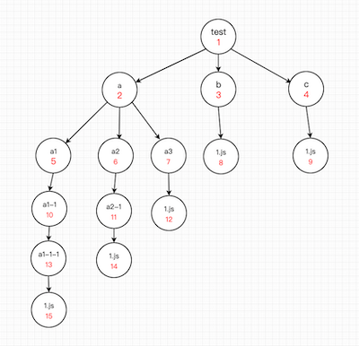
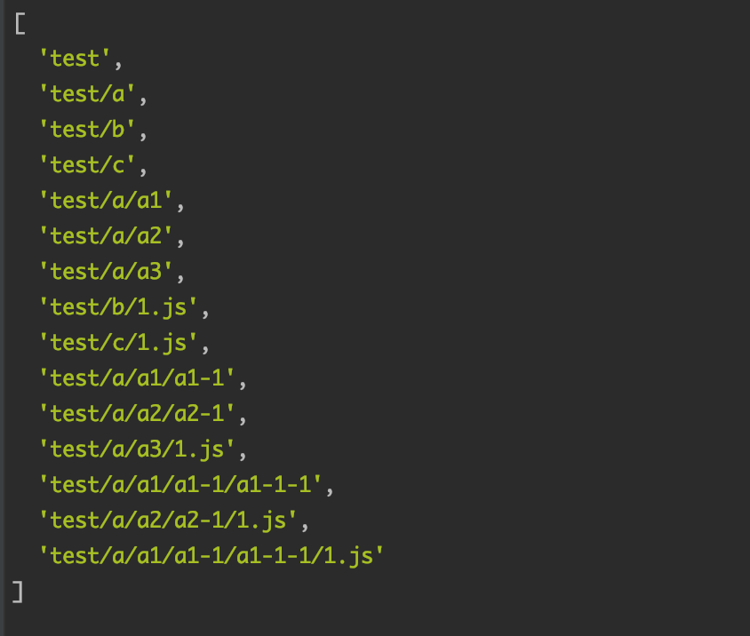

### 背景

在上传文件的时候，如果需要上传一个文件夹，我们必然要对文件夹进行遍历，本文简绍两种遍历方式：**深度优先遍历（DFS）**，**广度优先遍历（BFS）**。

### 准备


接着将这个文件夹转化为树的样子


这样之后，目录结构清晰了不少。

### 深度优先遍历（Depth-First Search）

该方法是以纵向的维度对目录树进行遍历，从一个目录节点开始，一直遍历其子节点，直到它的所有子节点都被遍历完毕之后在遍历它的兄弟节点。即如图所示（遍历顺序为红字锁标）：



js代码实现（递归版本）：

```javascript
function deepFirstSearch1(file, tree = []) {
    tree.push(absPath(file))
    const stat = fs.statSync(absPath(file))
    if (stat.isDirectory()) {
        const paths = fs.readdirSync(absPath(file))
        paths.forEach(path => {
            deepFirstSearch1(absPath(file, path), tree)
        })
    }
    return tree
}
```

非递归版本：

```javascript
function deepFirstSearch2(file) {
    const tree = []
    const stack = []
    stack.push(file)
    while (stack.length !== 0) {
        const first = stack.shift()
        const stat = fs.statSync(absPath(first))
        tree.push(absPath(first))
        if (stat.isDirectory()) {
            const paths = fs.readdirSync(absPath(first))
            Array.prototype.unshift.apply(stack, paths.map(path => absPath(first, path)))
        }
    }
    return tree
}
```

打印结果：



### 广度优先遍历（Breadth-First Search）

该方法是以横向的维度对目录树进行遍历，从该节点的第一个子节点开始，遍历其所有的兄弟节点，再遍历第一个节点的子节点，完成该遍历之后，暂时不深入，开始遍历其兄弟节点的子节点。即如图所示（遍历顺序为红字锁标）：



js代码实现（递归版本）：

```javascript
function breadthFirstSearch1(file, tree = [], brothers = [file]) {
    const next = []
    while (brothers.length !== 0) {
        const first = brothers.shift()
        const paths = fs.readdirSync(absPath(first))
        paths.forEach(path => {
            const stat = fs.statSync(absPath(first, path))
            tree.push(absPath(first, path))
            if (stat.isDirectory()) {
                next.push(absPath(first, path))
            }
        })
    }
    if (next.length !== 0) {
        breadthFirstSearch1(null, tree, next)
    }
    return tree
}
```

非递归版本：

```javascript
function breadthFirstSearch2(file) {
    const tree = []
    const queue = []
    queue.push(absPath(file))
    while (stack.length !== 0) {
        const first = queue.shift()
        const stat = fs.statSync(absPath(first))
        tree.push(absPath(first))
        if (stat.isDirectory()) {
            const paths = fs.readdirSync(absPath(first))
            Array.prototype.push.apply(queue, paths.map(path => absPath(first, path)))
        }
    }
    return tree
}
```

打印结果：



### 总结

BFS和DFS都是图的算法之一，本文所阐述的版本较为简单，为无向且非连通图，在日后会更新更多基于JavaScript的算法。