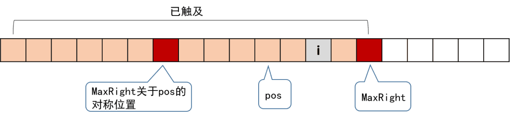
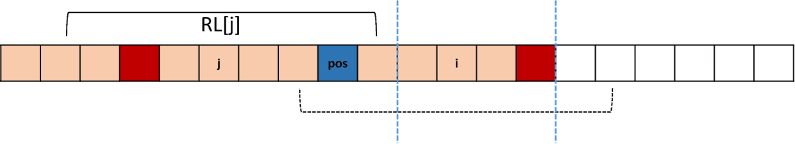

## 题目

本体来源于leetcode.409。	

给定一个字符串 s，找到 s 中最长的回文子串。你可以假设 s 的最大长度为 1000。

示例 1：

```
输入: "babad"
输出: "bab"
注意: "aba" 也是一个有效答案。
```

示例 2：

```
输入: "cbbd"
输出: "bb"
```

## 解法一：动态规划

首先有个定理，如果P\[i][j]（表示从到j的字符串）是回文字符串，那么P\[i+1][j-1]必是回文串。于是就可以推出这样的状态转移方程：

1. ​      P[i, j] = P[i+1, j-1]， if ( s[i]==s[j] )
2. ​      P[i, j] = 0，if ( s[i] != s[j] )

```js
var longestPalindrome = str => {
  if (str.length <= 1) return str
  let len = str.length
  let dp = []
  let result = str[0]
  // 首先初始化dp数组
  // 所有从自身开始和自身结束的字符串必是回文的，设为true
  // 紧邻的两个字符如果相等也是回文的，设为true （这一步很关键因为下面转化为子问题时，会被用到）
  for (let i = 0; i < len; i++) {
    if (!dp[i]) dp[i] = []
    dp[i][i] = true
    dp[i][i + 1] = str[i] == str[i + 1]
  }
  for (let i = len - 1; i > -1; i--) {
    for (let j = i + 1; j < len; j++) {
      if (str[i] == str[j] && dp[i + 1][j - 1]) { //会用到上面初始化过的相邻的两个元素dp结果
        dp[i][j] = true
      }
      if (dp[i][j]) {
        if (j - i + 1 > result.length) {
          result = str.slice(i, j + 1)
        }
      }
    }
  }
  return result
}
```

动态规划由于要遍历两遍，所以时间复杂度是O(N^2)级的，这不是最好的解法。

## 解法二：Manacher算法

从动态规划解法中，我们可以发现有子串会被重复遍历多次。那么怎么遍历，才能让子串遍历一次就可以呢？1975年由Manacher提出了一个算法，后已他的名字命名了这个算法。具体思路如下：

1. 由于在遍历过程中，要用到对称，为了避免原字符串长度的奇偶不同造成额外的处理，将字符每一项之间和头尾插入一个多余的字符，将原字符串总变为奇数长度。
2. 定义一个回文半径数组RL，所谓回文半径，就是以字符串中一项为中间点的最长回文串的半径，即回文串最右边到中间字符的个数，而此回文半径数组保存着以数组每一项为中间点的回文串的回文半径。
3. 定义两个变量：
   - maxRight:在求得回文半径的过程中，扫描到的最右边的字符串的位置
   - pos:`maxRight`对应的回文中心点的位置

举个例子：

```js
str:  a   b   a   d
str:# a # b # a # d #
RL: 1 2 1 4 1 2 1 2 1
len   1   3   1   1
```

可以看到RL[i]-1就是对应回文串的长度。

接着解决重复遍历的问题：

1. 当数组i项在maxRight左边时：

   当我们开始对i求回文半径时，不必从i开始。

   因为已知两个红色之间是回文的，那么i关于pos的对称点j的回文半径RL[j]，已经求过了。

   - 当RL[j]很小时：

     

     那么求RL[i]时可以直接从位置RL[j]+i-1的下一个元素开始判断是否是回文的。

   - 当RL[j]很大时：

     那么就从maxRight开始判断。

2. 当数组i项在maxRight右边时，那么就从i的下一项开始判断。

代码如下：

```js
var longestPalindrome = str => {
  if (str.length <= 1) return str
  // 将数组变为奇数项
  str = "#" + str.split("").join("#") + "#"
  let maxRight = 0
  let pos = 0
  let rl = []
  //记录最长的回文半径
  let max = 0
  //记录最长回文半径对应的数组项
  let sub = 0
  for (let i = 0; i < str.length; i++) {
    //从哪里开始判断回文
    let next = i
    //数组i项关于maxRight对应位置pos的对称位置
    let j = 2 * pos - i
    if (i < maxRight) { // 当i在maxRight的左边时
      next =
        rl[2 * pos - i] > maxRight - i
          ? maxRight //当rl[j]很大时，从maxRight开始
          : i + rl[j] - 1 //当rl[j]很小时
    } else { // 当i在maxRight的右边时
      next = i
    }
    //判断下一项关于对称位置元素是否相等，相等则继续
    while (str[next + 1] == str[2 * i - (next + 1)] && next + 1 < str.length) {
      next += 1
    }
    //记录遍历到数组最右边的那个位置了和对应中间位置
    if (next > maxRight) {
      maxRight = next
      pos = i
    }
    rl[i] = next - i + 1
    if (max < rl[i]) {
      max = rl[i]
      sub = 2 * i - next
    }
  }
  return str.substr(sub, (max - 1) * 2 + 1).replace(/#/g, "")
}
```

可以看到对于每一元素只遍历了一次，所以时间复杂度就是O(n)。

